## Hi there 👋

## Stats

## Used Languages

## 📜 我的开源许可协议

我的项目采用由我发起维护的 **Selective Freedom License (SFL) v1.0**（即 “MIT-NoHuawei”）：

- 继承 MIT 的宽松许可：允许自由使用、修改、再分发；
- 关键差异：**明确排除华为** 及其关联公司、附属机构、雇员、代表、承包商获得任何许可权利；
- 发起缘由：回应华为对开源社区“技术白嫖”的做法（如 OpenHarmony.Avalonia 事件中，合作方被窃取技术后踢出团队）。

🔗 协议全文与说明：[github.com/bighamx/MIT-NoHuawei](https://github.com/bighamx/MIT-NoHuawei)

> 说明：我名下项目的自研代码与构建脚本均采用 SFL；若打包了第三方组件（如 GPL / Apache 上游），相应组件仍遵循各自上游许可证。